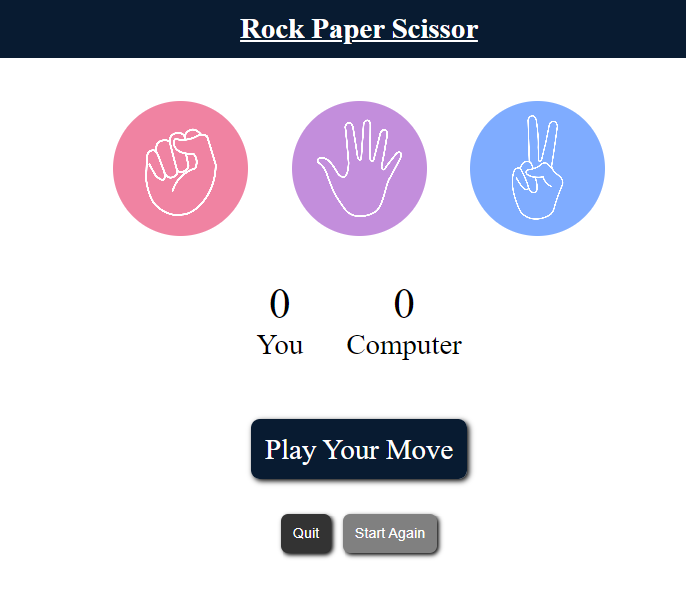
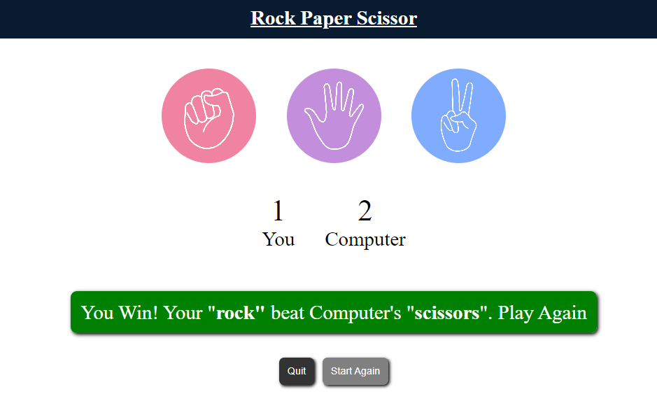
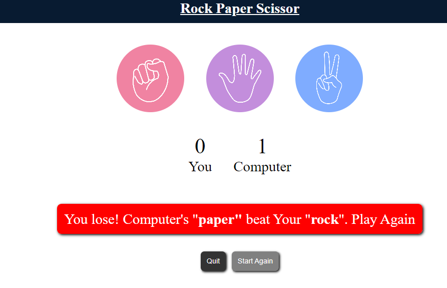

# 🎮 Rock Paper Scissors Game

A classic **Rock Paper Scissors** game built using **HTML, CSS, and JavaScript**. Enjoy a responsive UI, smooth game logic, and an interactive experience against the computer!

> 🧑‍💻 Perfect for beginners learning DOM manipulation and event handling in JavaScript.

---

## 🌐 Live Demo

🔗 [Click here to play online]( https://umramirza.github.io/Rock-Paper-Scissiors-Game/)  

---

## 📸 Preview

| Home Screen | You Win | You Lose |
|-------------|---------|----------|
|  |  |  |

---

## ✨ Features

- 🎲 Randomized computer choices
- 🧑‍🤝‍🧑 User vs Computer gameplay
- 📊 Scoreboard to track scores
- 🎨 Hover and visual effects
- 🧼 Clean and responsive UI
- 🔁 Quit & Restart functionality

---

## 🗂 Project Structure

rock-paper-scissors/

├── index.html # Main HTML file

├── style.css # Styling for the game

├── app.js # JavaScript game logic

├── images/ # Game icons/images

│ ├── rock.png

│ ├── paper.png

│ └── scissors.png

├── screenshots/ # Screenshots for README

│ ├── start.png

│ ├── win.png

│ └── lose.png

└── LICENSE # MIT License

└── README.md # Project documentation

## 🛠 Built With

HTML5 – Markup structure

CSS3 – Styling and hover effects

JavaScript – Game logic and DOM control

## 📦 Future Enhancements

✅ Add round history panel

🔉 Sound effects on win/loss

📱 Fully mobile-friendly design

🧠 Add AI-based difficulty levels

## 📄 License  

This project is licensed under the [MIT License](LICENSE).  
© 2025 Umra Mirza

## 🙋‍♀️ Author

**Umra Mirza**  
💻 Frontend Developer  
🔗 [GitHub](https://github.com/umramirza) • [LinkedIn](https://www.linkedin.com/in/umra-mirza-4525962a2)

---

## ⭐ Show Your Support

If you like this project, please give it a ⭐ on GitHub and share it with your friends.

